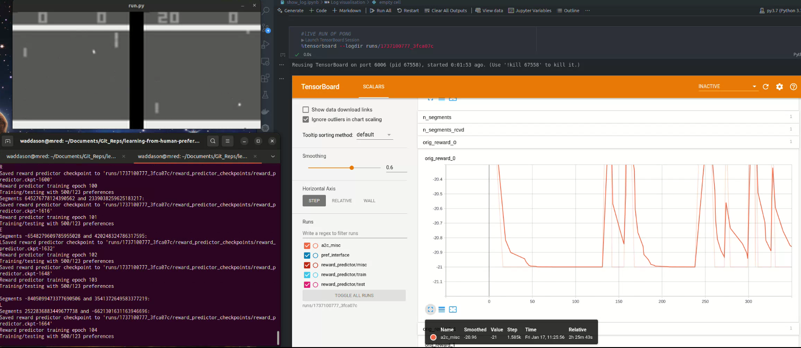

# Learning from Human Preferences

Welcome to the **Learning from Human Preferences** repository. This project aims 
to explore and implement the method of the paper *Deep Reinforcement Learning from Human Preferences*,  from de Christiano et al.(v4 de 2023)

The main purpose is to train an agent to perform robotic tasks or play to Atari Games, aligned  with human preferences.


## Table of Contents
- [Introduction](#introduction)
- [Getting Started](#getting-started)
- [Project Structure](#project-structure)
- [Usage](#usage)


## Introduction

This repository contains code and resources for learning from human preferences. The goal is to leverage human feedback to train models that can make better decisions and predictions.
This is a fork of the amazing work of Matthew Rahtz.

## Getting Started

To get started with this project, follow these steps:

1. Clone the repository:
    ```bash
    git clone https://github.com/yourusername/learning-from-human-preferences.git
    ```
2. Navigate to the project directory:
    ```bash
    cd learning-from-human-preferences
    ```
3. Install the required dependencies by setting up setup a legacy environment

    ```bash
        conda create -n py3.7 python=3.7
        pip install tensorflow-gpu==1.15.0
        pip install -r req.txt
        
    ```

## Project Structure

The project is organized as follows:
- `README_original.md`: Original author recommendations.
- `wad_notes.md`: Notes and actions taken by students.

- `a2c/`: Contains the A2C workers.
- `floydhub_utils/`: Contains utilities for FloydHub. (Discaded)
- `images/`: Contains image assets.
- `mem_utils/`: Contains memory utilities.
- `logs.ipynb`: Jupyter notebook for logs.
- `nn_layers.py`: Neural network layers implementation.
- `params.py`: Parameter configurations.
- `pref_db_test.py`: Tests for preference database.
- `pref_db.py`: Preference database implementation.
- `pref_interface_test.py`: Tests for preference interface.
- `pref_interface.py`: Preference interface implementation.
- `reward_predictor_core_network.py`: Core network for reward predictor.
- `reward_predictor_test.py`: Tests for reward predictor.
- `reward_predictor.py`: Reward predictor implementation.
- `run_checkpoint.py`: Script to run checkpoints.
- `run_test.py`: Script to run tests.
- `run.py`: Main script to run the project.
- `runs/`: Contains run outputs. (not uploaded)
- `show_log.ipynb`: Jupyter notebook to show logs.
- `show_prefs.py`: Script to show preferences.
- `utils_test.py`: Tests for utilities.
- `utils.py`: Utility functions.


## Usage


For more detailed information, please refer to the `readme_original.md` for the original author's recommendations and `wad_notes.md` for the actions taken by the students.

## Reproducing
1. Train pong with original rewards: runs/1736865979_3fca07c
`$ python3 run.py train_policy_with_original_rewards PongNoFrameskip-v4 --n_envs 16 --million_timesteps 10`
Saved policy checkpoint to 'runs/1736865979_3fca07c/policy_checkpoints/policy.ckpt-125000'

2. Visualize the results with tensorboard in a notebook (see [example notebook](logs.ipynb):
`%%tensorboard`
`%tensorboard --logdir runs/1736865979_3fca07c`


